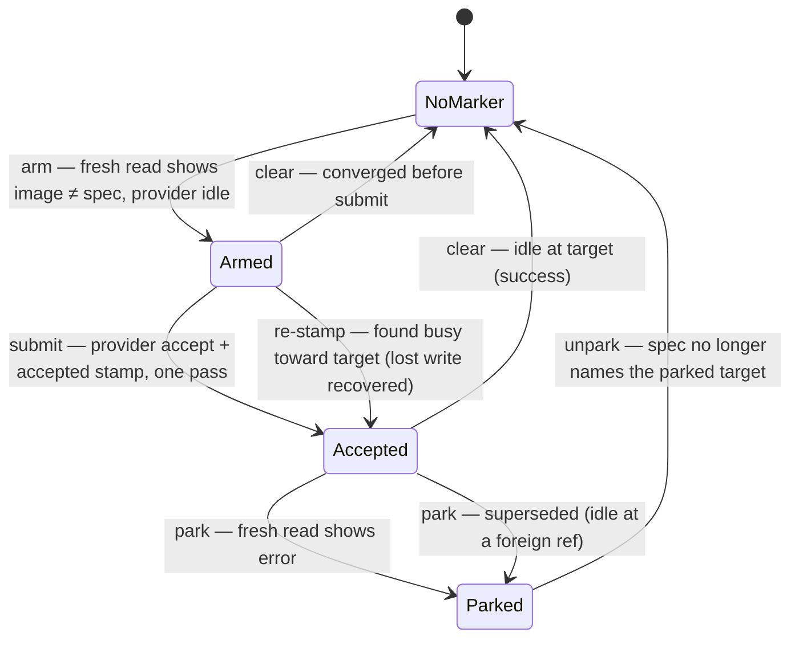
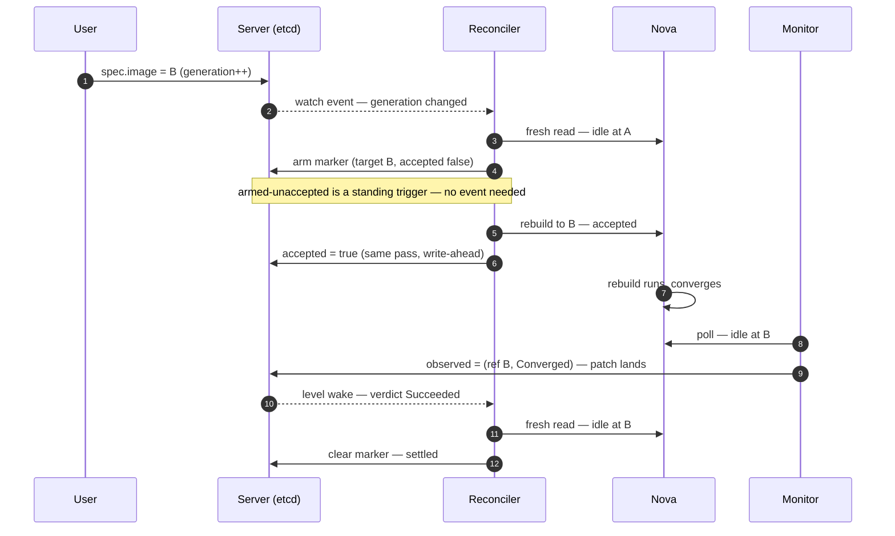
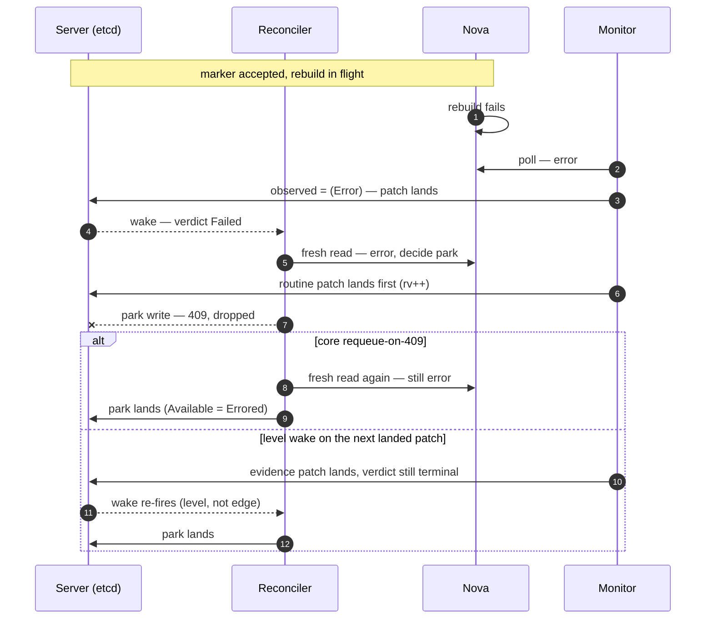
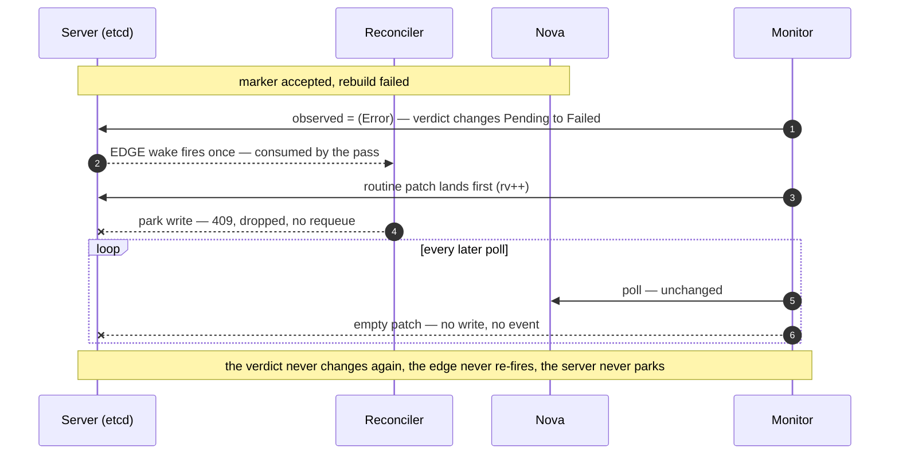
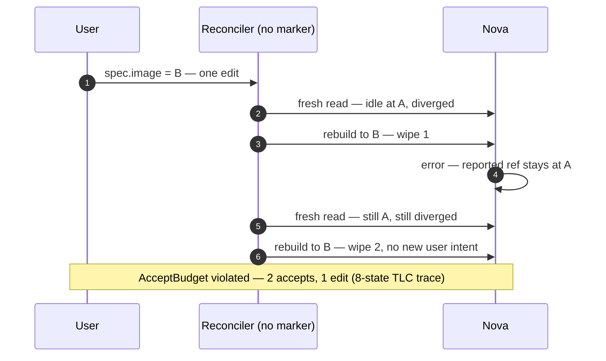

# Server Rebuild Protocol: A Machine-Checked Specification

**Date**: 2026-07-31
**Status**: Draft
**Normative artifact**: [`tla/ServerRebuild.tla`](tla/ServerRebuild.tla), checked by TLC
against the four configurations in [`tla/`](tla/README.md).

## 0. How to read this document

This spec is a prose rendering of the TLA+ model, not an independent design that
the model happens to test. Every rule in §§2–6 corresponds to a named action,
guard, or definition in `ServerRebuild.tla`; every claim in §7 is a property TLC
exhaustively checked. Where this prose and the model disagree, **the model
wins** — and the fix is to change the model, re-run TLC, and then update the
prose (§9).

Three kinds of statement appear below, and it matters which is which:

- **Checked** — TLC verified it over every reachable interleaving of the model.
- **Assumed** — the model takes it as given; the implementation must uphold it
  or the checked results do not transfer (§8, "Obligations").
- **Unmodeled** — deliberately outside the model; needs its own design work
  (§8, "Limits").

## 1. The system

Four processes act on one `Server`:

| Process | Model actions | Shape |
|---|---|---|
| **User** | `UserEdit` | Flips `spec.image`; each edit bumps `metadata.generation` |
| **Reconciler** | `RStart`, `RFinish`, `RAbort` | Two-phase: snapshot etcd → decide from a **fresh provider read** → write back under optimistic lock |
| **Monitor** | `MRead`, `MWrite` | Two-phase: snapshot provider + Server generation → merge-patch `status.observed` under optimistic lock |
| **Provider (Nova)** | `NovaOK`, `NovaErr` | Progresses an accepted rebuild to converged or error; on error the image ref stays where it was |

The reconciler may crash between deciding and writing (`RAbort`); a restart is
always followed by an informer re-list that re-enqueues the object.

## 2. State and ownership

The object splits into single-writer regions. This partition is the point of
the design: no field has two writers, so no writer can clobber another's data —
only lose an optimistic-lock race, which is recoverable by construction (§6).

| Model variable | Object field | Sole writer |
|---|---|---|
| `spec` | `spec.image` | User (via API) |
| `gen` | `metadata.generation` | API server (on spec change) |
| `intent` | rebuild intent, in reconciler-owned status | Reconciler |
| `parked` | park latch (`Available=Errored`) | Reconciler |
| `obs` | `status.observed` | Monitor |

**Rebuild intent** (`intent`) carries five facts:

- `present` — a rebuild attempt is armed
- `targetImageID` (`tgt`) — the image the attempt converges toward
- `preArmImageRef` (`pre`) — the provider's image ref at arming time
- `armingGeneration` (`ag`) — `metadata.generation` when armed
- `accepted` (`acc`) — the provider has accepted the rebuild (write-ahead:
  stamped in the same pass that submits)

**Observation** (`obs`) carries four facts, all object-level — the monitor
reads no rebuild intent and knows nothing about attempts:

- `populated` (`pop`) — the monitor has looked (looked-and-absent is a positive
  observation, not a skip)
- `image.ref` — the provider's current image
- `image.disposition` (`disp`) — `Rebuilding` / `Converged` / `Error`
- `serverGeneration` (`sg`) — the Server generation the monitor saw when it
  took the provider snapshot

## 3. The verdict function (checked: `Verdict`)

Settlement is a pure function of `(intent, obs)` — no provider call, no hidden
state, exhaustively unit-testable:

```
correlated := obs.serverGeneration >= intent.armingGeneration     (the fence)
superseded := obs.image.ref ∉ {intent.preArmImageRef, intent.targetImageID}

verdict = Pending    if ¬intent.present ∨ ¬obs.populated ∨ ¬correlated
        = Succeeded  if obs.image.ref = intent.targetImageID ∧ disposition = Converged
        = Failed     if disposition = Error ∨ (intent.accepted ∧ superseded)
        = Pending    otherwise
```

Two subtleties the model pins down:

- **The fence is wake hygiene, not safety.** `_nofence` (fence off) passes all
  properties: no wrong action can result from stale evidence because actions
  are gated on fresh provider reads (§4), not on the verdict. The fence exists
  so pre-arm evidence doesn't fire spurious wakes.
- **Supersession requires acceptance.** An armed-but-unaccepted intent whose
  evidence shows a foreign ref is `Pending`, not `Failed` — the window between
  arming and submission legitimately shows `preArmImageRef`.

## 4. The decision procedure (checked: `Decision`)

Each reconcile pass decides **from the snapshot plus a fresh provider read** —
never from `status.observed`. The observation is a stimulus, not an
authorization. The full procedure, top match wins:

| State | Fresh provider read shows | Action |
|---|---|---|
| Parked | spec no longer names the parked target | **unpark** (clear latch and intent) |
| Parked | otherwise | noop |
| No intent | image ≠ spec ∧ provider idle | **arm** (`tgt := spec`, `pre := provider image`, `ag := generation`, `acc := false`) |
| No intent | otherwise | noop |
| Armed, not accepted | busy rebuilding toward our target | **accept** (re-stamp the lost acceptance — never resubmit) |
| Armed, not accepted | idle at target | **clear** (converged before submit) |
| Armed, not accepted | idle or errored | **submit** (provider accept + stamp `accepted` in one pass) |
| Armed, not accepted | otherwise | noop |
| Accepted | idle at target | **clear** (success) |
| Accepted | errored | **park** |
| Accepted | idle at a ref ∉ {pre, target} | **park** (superseded) |
| Accepted | otherwise (still rebuilding) | noop |

Rules the table encodes, each load-bearing for a checked property:

- **One accept per attempt** (`AcceptOnce`): the only path to a provider
  accept is `submit`, and `submit` requires `¬accepted`. A pass that finds the
  provider already busy toward the target re-stamps the marker instead of
  resubmitting — the recovery for an acceptance write lost to a crash or 409.
- **Parks cite fresh evidence** (`ParkHonest`): both park rows are gated on
  what the pass's own provider read returned, never on `status.observed`.

## 5. Scheduling: what wakes the reconciler (checked: `RTrigger`)

```
trigger = settlementWake ∨ restartRelist ∨ (generation > lastSeen) ∨ (armed ∧ ¬accepted)
```

- **Settlement wake** — set when a monitor patch *lands* (empty patches make
  no write and no event) and the resulting state satisfies the **level**
  predicate: `intent.present ∧ intent.accepted ∧ ¬parked ∧ verdict ∈
  {Succeeded, Failed}`. Level, not edge: it fires on *any* landed evidence
  write while the verdict is terminal, not only when the verdict changes.
  This is a hard requirement — see the `edge_norequeue` counterexample in §7.
- **Restart re-list** — every crash is followed by re-enqueueing the object
  (controller-runtime informer behavior).
- **Generation advance** — spec edits reconcile.
- **Armed-but-unaccepted intent** — a standing trigger: an intent that hasn't
  reached the provider yet retries until it does (or clears). This is why no
  wake fires *for* arming: the state itself is the trigger, closing the
  double-submit window without an event.

**Conflict handling**: a reconciler status write that loses the optimistic
lock (409) **requeues** (core's fixed-interval retry). A monitor patch that
loses it is dropped; the next poll retries naturally.

## 6. Why every interleaving is harmless (the concurrency stance)

The protocol never tries to prevent interleavings — it makes them harmless:

1. The monitor never actuates; its writes carry facts, not decisions.
2. Every actuation decision re-derives from a fresh provider read at decision
   time, so stale stimuli cannot cause wrong actions — only wasted passes.
3. Every status write is optimistically locked, so a lost race loses the
   *write*, never corrupts data.
4. Every lost write has a recovery path that re-fires it: lost park → level
   wake or 409-requeue (either alone suffices, §7); lost acceptance stamp →
   `accept` re-stamp; crash → re-list; lost arm → the spec/image divergence
   that motivated it still triggers via generation or re-list.

## 7. Checked properties and results

**Safety** (invariants over all reachable states):

- `AcceptOnce` — at most one provider accept per armed attempt.
- `ParkHonest` — every park was justified by the parking pass's own fresh
  provider read (error, or converged to a ref outside {pre, target}).

**Liveness** (under fairness: the monitor keeps polling, the reconciler runs
when triggered, the provider finishes what it accepted):

- `EventuallySettled` — an accepted rebuild eventually clears or parks. No
  hung rebuilds.

| Configuration | Marker | Level wake | Fence | 409-requeue | Result |
|---|---|---|---|---|---|
| `ServerRebuild.cfg` (**designed**) | ✓ | ✓ | ✓ | ✓ | **all pass** (4,685 distinct states) |
| `_level_norequeue` | ✓ | ✓ | ✓ | ✗ | **all pass** — the level wake alone recovers a conflict-dropped park |
| `_edge` | ✓ | ✗ | ✓ | ✓ | **all pass** — the 409-requeue alone recovers it under edge triggering |
| `_edge_norequeue` | ✓ | ✗ | ✓ | ✗ | **liveness fails** — TLC reproduces the hung rebuild: the edge fires once, the pass consumes it, a monitor patch 409s the pass's write, and unchanged-verdict polls are empty patches that never re-fire |
| `_nofence` | ✓ | ✓ | ✗ | ✓ | **all pass** — the fence is wake hygiene, not a safety mechanism |
| `_stateless` | ✗ | ✓ | ✓ | ✓ | **safety fails** (`AcceptBudget`, 8-state trace) — deciding from spec vs fresh read alone, a provider error that leaves the reported ref at the old image resubmits the destructive rebuild with no new user intent |
| `_stateless_refupdate` | ✗ | ✓ | ✓ | ✓ | **all pass** — stateless is safe *iff* Nova's reported ref reliably flips at accept, i.e. iff the provider's own bookkeeping serves as the write-ahead marker |

The matrix gives the design's key structural fact: settlement liveness has
**two independently sufficient mechanisms** — the level wake and the
409-requeue. The design keeps both; losing both (with edge triggering) is the
known production failure mode, and the model produces it as a counterexample
rather than taking the regression comment's word for it.

The stateless pair answers "why keep any marker at all": `AcceptBudget`
(every destructive accept is paid for by a user edit — `accE <= edits`) is
the property the two-field marker carries. Without the marker, the same
property survives only if Nova's accept-time ref bookkeeping is total and
truthful across every error path and driver — per-driver, undocumented
behavior, and the exact bookkeeping INST-1235 catches lying on baremetal.
The marker records that accept in the object we control, under our
optimistic lock, independent of the provider.

### 7.1 The scenarios, drawn

The marker's lifecycle (§4's decision table, viewed from the marker; every
transition is taken by the reconciler from a fresh provider read — the
monitor never moves this machine, it only supplies wakes):



**The happy path** (designed config) — the observation is a stimulus, the
action re-derives from the fresh read:



**The park-conflict race, both recoveries** (rows `_edge` and
`_level_norequeue` — TLC shows each `alt` branch alone suffices):



**The hung rebuild** (row `_edge_norequeue` — the production failure mode,
reproduced by TLC as a lasso counterexample):



**The stateless double-wipe** (row `_stateless` — without the marker, a
failed rebuild is indistinguishable from one that never started):



## 8. What the model assumes and what it leaves open

**Obligations** — assumptions the checked results rest on; the implementation
must uphold each, and each is a natural test target:

1. A same-image spec update is an API no-op: every real edit bumps the
   generation (`UserEdit` models this; it is what makes the generation fence
   and `generation > lastSeen` trigger sound).
2. Monitor patches are narrow (only `status.observed`), optimistically locked,
   and dropped-not-retried on conflict.
3. Unchanged observations produce **no write and no watch event** — no wake
   predicate may depend on polls that found nothing new.
4. The reconciler decides from a fresh provider read, never from
   `status.observed`.
5. The reconciler's status write requeues on conflict (current core
   `reconcile.go` behavior — keep it).
6. Restarts re-list (stock controller-runtime informers — don't disable).
7. The monitor reads no rebuild intent and writes nothing outside
   `status.observed`.
8. The settlement wake predicate is evaluated as a **level** on every landed
   `status.observed` write.

**Limits** — unmodeled, needing separate design or a model extension:

- Provider accept is synchronous in the model (submit ⇒ busy), so the
  armed-but-unstarted evidence window that `preArmImageRef` guards cannot
  mis-act *in the model*; its value is wake hygiene and display. An
  async-accept extension would exercise it.
- Foreign rebuilds (an actor other than the reconciler rebuilding the server)
  are not modeled; the `superseded` clause is their designed handler.
- Staleness *display* (how a UI learns the observation is old — lease, an
  `Observed` condition, `status.observedGeneration`) is invisible to the
  protocol: no action reads it. It is presentation-layer and specified with
  the field encodings below.
- Bounds: one server, two images, ≤2 spec flips, ≤1 crash, resourceVersion
  ≤ 14. Small, but sufficient for every race the protocol must survive.

**Open engineering decisions** (deliberately not fixed by this spec):

- Field encodings: `metav1.Condition` vs plain typed fields for
  `status.observed`; exact CRD schema and names.
- Migration from the current dual-writer `Status.Rebuild` (dual-write release,
  cutover release, rollback rules).
- Non-rebuild observed state (power, addresses) moving into the same
  `status.observed` partition — same ownership rule, no protocol content.

**Decided** (2026-07-31): the monitor stays in this change; consolidating it
into the reconciler (timer-driven polling) is a future exercise. The protocol
is neutral on that collapse — no decision reads `status.observed`, so a timer
supplies the same stimulus — but while the monitor is the stimulus source,
the level wake predicates (obligation 8) are load-bearing for liveness and
must not be deleted with the rest of the legacy plumbing.

## 9. Change control

The model is the spec. To change the protocol:

1. Edit `tla/ServerRebuild.tla` (and configs if a guard becomes toggleable).
2. Re-run TLC on all four configurations; the designed config must pass
   `TypeOK`, `AcceptOnce`, `ParkHonest`, `EventuallySettled`, and the buggy
   variants must still fail exactly where they document a hazard.
3. Update this document to match.

```sh
cd docs/superpowers/specs/tla
java -cp tla2tools.jar tlc2.TLC -deadlock -workers 4 \
  -config ServerRebuild.cfg ServerRebuild.tla    # and the _* variants
```

A prose-only change that alters a rule in §§2–6 without a corresponding model
change is a spec bug.
